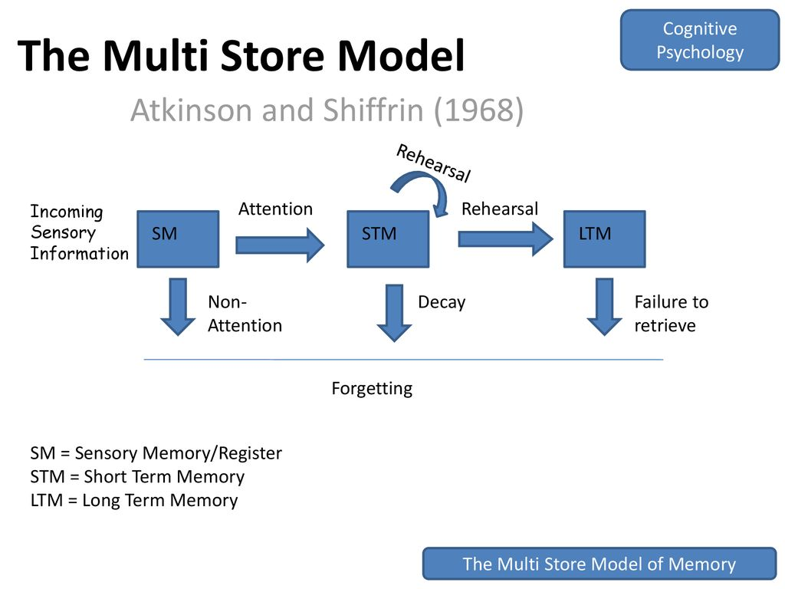
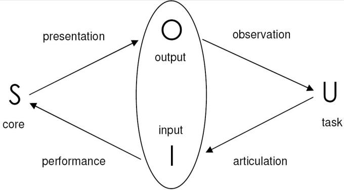

# Principios Fundamentais
- Útil => eficaz: cumpre os objetivos;
- Utilizável => eficiente: fácil, intuitivo, seguro;
- Utilizado => atrativo: agradável e recompensador. 

# Olho Humano
- A luz recebida é transformada em sinais eletricos;
- A luz emitada é refletida pelos objetos;
- A retina foca as imagens de cima para baixo;
- A retina contem dois tipos de fotorecetores:  
Bastonetes - sensibilidade luminosa; visão periferica;  
Cones - visão cromática.
- Os ganglions são celulas que detetam padrões e movimentos.

# Ouvido Humano
O ouvido humano é muitas vezes visto como sensor secundário, mas...  
- Há muita mais informação a entrar do que a ser considerada;
- A pinna atua como um funil para que o som entre no ouvido;
- Nós somos capazes de estimar distâncias, devido ao atraso entre a receção do som entre as dois ouvidos.

## Aparato físico 
- Exterior da orelha: protege o interior da orelha e amplia o som recebido;
- Meio da orelha: transmite ondas de som como também vibrações para o interior da orelha;
- Interior da orelha: transmissores químicos são libertados e causão impulsos no nervo auditivo;

## Som
- Tom: frequência(Hz);
- Volume: amplitude(dB);
- Timbre: tipo e qualidade.

## Processamento do som
- O ouvido humano tem capaciade de ouvir frequências entre 20Hz-15kHz;
- A baixas frequências nós conseguimos detetar diferenças de 1.5Hz;
- A altas frequências nós perdemos sensibilidade;
- O cerebro filtra sons de maneira muito eficiente;
- Existem ilusões de audio.

# Toque
- Estimulado atravez de recetores localizados na pele:  
Mecano-recetores(Pressão);  
Termo-recetores(Calor);  
Nocio-recetores(Dor ou pressão intensa).
- Sensibiliade heterogenia:
A sensibilidade de um toque é 10x a sensibilidade do antebraço.

# Movimento
- O movimento é feito de de duas caracteristicas essenciais:  
Rapidez;  
Pressão. 
- Rapidez depende:  
Tempo de processamento;  
Tempo de ação.
- O tempo de resposta a um estimulo depende:  
tempo de reação + tempo de movimento.
- Tempo de reação o quão rápido um organismo consegue responder a um estimulo particular.
- Dependendo do tipo de estimulo:  
<strong>Dor(700ms) > Visual(200ms) > Audição(150ms).</strong>

# Memória Humana

A memória é dividida em 3 tipos:
- Memória sensorial;
- Memória de curto-prazo/Memória de trabalho;
- Memória de longo-prazo.

A memória sensorial passa para memoria de curto-prazo a partir do canal de atenção por sua vez para se tornar memória de longa duração é transferido a partir do canal de ensaio.

## Memória sensorial
- Memória icônica: estimulo visual;
- Memória ecóica: estimulo auditivo;
- Memória háptica: estimulo tatil.
- Estes buffers estão constantemente a ser reescritos.

## Memória a curto-prazo
- Armazenamento de informação temporária:  
Rápido acesso 70ms;  
Rápido esquecimento 200ms;   
Capacidade limitada de 7 +- 2 chunks.
- <strong>Chuncking: aumenta a eficiência do uso da memória;</strong>
- Chunking leva ao Closure;
- A falha na closure leva o utilizador a perder localização mental, levando a que ele cometa falhas.

## Memória a longo-prazo
Existem dois tipos:
- Episódica: memoriza sequencias de eventos;
- Semântica: memoriza estrutua de factos, conceito. Nós conseguimos pensar num gráfico modelo, como também em classes com atributos e conexões.
- Semântica deriva da Episódica.

### Lei de Jost
Se duas memórias são igualmente fortes, a mais antiga predura 

# Resolução do problema(Problem Solving)
Processo de encontrar a solução para uma tarefa diferente usando o conhecimento.  
Muitas teorias:
- Behaviourism(comportamentalistas):  
Reprodutivo + tentativa erro.
- Gestalt(não comportamentalista):  
Resolução do problema ambos produtivo e reprodutivo;  
Produtivo desenha á vista e retrutura o problema;  
Atrativo mas não há evidências suficiente para explicar á vista o que é;  
Afasta-se do comportamentalismo e vai em direção a teorias de processamento de informação.

## Teoria do problema de espaço
- O problema do espaço compreende o problema de estados;
- Problem solving envolve gerar estados usando opredaores legais;
- Heurísticas podem ser empregadas para selecionar operadores;
- Opera dentro do sistema de processamento de informações humanas;
- Largamente aplicado no Problem solving em áreas bem definidas.

# Erro Humano
Tipos de erro:
- Deslizes/Falhas(Slip):  
Intenção correta, mas falha ao tentar fazer;  
Causas: pouca atenção, pouca skill para o fazer;  
Aspeto parecido a algo conhecido mas com uma funcionalidade diferente.
- Enganos(Mistakes):  
Intenção incorreta;  
Causa: Entendeu mal o que era suposto fazer.
- O ser Humano cria modelos mentais para explicar comportamentos, se estiver errado erros podem ocorrer.

# Emoções Humanas
- A resposta biologica para um estimulo fisico é chamado de afeto, que leva a uma interpretação como uma emoção;
- Afeto influência como nós respondemos a uma situação:  
positivo: uma resolução de problema creativa;  
negativo: Pensar demais.
- Implicações de um design de interface:  
Stress aumenta o nivel de dificuldade do problema;  
Utilizador relaxado será tolerante com deficiências no design;  
Uma interface esteticamente bonita e recompensadora aumentará os aspetos positivos.

# Office Interface vs Industrial Interface

|| Office | Industrial |
|---------------|--------|------------|
| Tipo de dados: | Textual | Numerico |
| Taxa de variação: | Lenta | Rápida |
| Ambiente: | Limpo | Sujo |
| Tipo de interação: | Mundo artificial | Mundo real | 

Industrial tem uma manipulação indireta, pois interage com o mundo real atravez de uma interface.

<strong>Verificar pdf aula 8 nada escrito aqui</strong>

# Teoria da cor 
7 principios:
- Hamonia: Combinação de elementos similares(cores, formas, intensidade, etc);
- Contraste: Combinção de cores opostas ou diferentes niveis de saturação;
- Ritmo;
- Repetição: Formas e tonalidades são repetidas seguidas de padrões bem definidos;
- Gradiente/Degradê;
- Balanciamento: Distribuição de elemtnos de um forma simetrica ou asimetrica;
- Dominio: Quando uma cor domina por vezes pode unificar partes em conflito, formando assim um contexto.

# Principios para suportar a usabilidade(Principles to support usability)
- Learnability(Aprendizagem): A facilidade com que novos usuários podem iniciar uma interação efetiva e alcançar o máximo desempenho;
- Flexibility(Flexibilidade): A multiplicidade de maneiras pelas quais o usuário e o sistema trocam em formação;
- Robustnes(Robustez): O nível de suporte fornecido ao usuário para garantir o sucesso realização e avaliação do comportamento direcionado a metas;

# Principios de aprendizagem(Principles of learnability)
- Predictability(Previsão): efeito determinante de ações futuras com base em histórico de interações anteriores;
- Synthesizability(Sintetização): avaliar o efeito de ações passadas;
- Familiarity(Familiaridade): como o conhecimento prévio se aplica ao novo sistema;
- Generalizability(Generalização): estendendo o conhecimento específico de interação para novos situações;
- Consistency(Consistência): semelhança no comportamento de entrada/saída decorrente de situações ou objetivos da tarefa;

# Principios de flexibilidade(Priciples of flexibility)
- Iniciativa de dialogo: liberdade de restrições impostas pelo sistema na entrada diálogo;
- Multithreading: capacidade do sistema de suportar a interação do usuário por mais de uma tarefa por vez;
- Task migrability: passando a responsabilidade pela execução da tarefa entre o usuário e sistema;
- Substitutivity(Equivalência): permitindo que valores equivalentes de entrada e saída sejam substituídos um pelo outro;
- Customizability(Parametrização): O usuário modifica/parametriza o sistema(adaptabilidade);O sistema se ajusta automaticamente(adaptabilidade).

# Principios de robustez (Priciples of robustness)
- Observability: capacidade do usuário para avaliar o
estado interno do sistema a partir de sua representação perceptível;
- Recoverability: capacidade do usuário de tomar medidas corretivas
ação uma vez que um erro foi reconhecido;
- Task conformance: Grau em que os serviços do sistema suportam todos os
tarefas do usuário;
- Responsiveness: Como o usuário percebe a taxa de comunicação com o sistema.

# ISO 9241
Define: 
- Usability(Usabilidade);
- Efficiency(Eficiência);
- Satisfaction(Satisfação);
- Effectiveness(Eficácia).

# Nielsen 10 Heuristics
- Visibilidade dos status do sistema;
- Correspondência entre o sistema e o mundo real;
- Controlo e liberdade do utilizador;
- Consistência e standards;
- Prevenção de erro;
- Reconhecimento em vez de lembrança;
- Flexibilidade e eficiência de uso;
- Estetica e desing minimalista;
- Ajudar os utilizadores a reconhecer, diagnosticar, e recoperar;
- Ajuda e documentação

# 7 principios de Norman
- Usar o conhecimento no mundo e conhecimento dentro da cabeça;
- Simplificar a estrutura das tarefas;
- fazer as coisas visiveis: atravessar os golfos de Execução e Avaliação;
- Conseguir mapeamentos corretos;
- Explore o poder das restrições, tanto naturais e artificiais;
- Design para o erro;
- Quando tudo o resto falhar, standardizar.

# Modelo de Donald Norman
- O utilizador estabelece o objetivo;
- Formula  intenção;
- Especifica as ações na interface;
- Executa a ação;
- Percebe o estado do sistema;
- Interpreta o estado do sistema;
- Avalia o estado do sistema com o respetivo objetivo.

Golfo de Execução: formulação de ações do usuário ≠ ações permitidas pelo sistemas.  

Golfo de Avaliação: expectativa do usuário de estado do sistema alterado ≠ real apresentação deste estado.

# Adowd and Beale
## Framework
Uma extensão ao modelo de Donald Norman que é constituido por 4 partes:  
- User;
- Input;
- System;
- Output.

## Modelo
Intenção do utilizador:
1. traduzido em ações na interface;
2. traduzido para alterações no systema;
3. refletido no output do programa;
4. Interpretado pelo utilizador.

Framework geral para compreender a interação:
- Acessivel a todo o tipo sistemas;
- Indentifica todos os componentes involvidos na interação;
- Permite comparar avaliação de sistemas;
- Uma abstração.

# Regras de ouro de Shneiderman(Golden rules)
- Esforce-se pela consistência;
- Permitir utilizadores frequêntes usar atalhos;
- Oferecer feedback informativo;
- Diálogos de design para produzir o fechamento;
- Oferecer prevenção de erros e simples manipulação de erros;
- Permitir reverter ações facilmente;
- Suporte locus de controle interno;
- Reduza a carga de memória de curto prazo.

# Modelos cognitivos 
- GOMS
- KLM
- BNF

# Tecnica do mágico de OZ 
Tecnica usada para simular funcionalidades inexistentes num produto, sendo assim desnecessário haver a criação do produto para saber a sua utilidade e eficiência.

# Regras de Design

## Web Desing Errors
- Má forma de navegar;
- usar ficheiros pdf para leitura online;
- Não mudar a cor dos links já vistos;
- Tamanho de letra fixo;
- Páginas com uma barra de pesquisa muito pequena;
- Qualquer coisa que pareça uma publicidade;
- Violar regras de desing convencional;
- Abrir novos sepadores no browser;
- Não responder a questões dos usuarios;
- Texto não escaneável.